## Test scores

This page covers indicators related to test scores of students attending Hartford area districts. 

Enrollment patterns for the region mean that students in school districts for the 30 towns in the CRCOG region are not the same as the school-age population living in the region. For instance, students from towns outside the region may attend schools located within the 30-town CRCOG region. In addition, students living in the region that attend private schools, are home-schooled or pursue other alternatives are not captured.

## Data and limitations

Data on test scores for Connecticut are available from the [State Department of Education](http://sdeportal.ct.gov/Cedar/). 

## What do we already know?

Indicators for test scores ranked highly in the survey and are used in several reports. 

### Local

* [CT Fair Housing Center Opportunity Mapping](http://www.ctfairhousing.org/people-place-and-opportunity-report/) (developed with the Kirwan Institute at Ohio State) includes students with passing math and reading test scores from SDE. 
* [CT Kids Report Card](http://www.cga.ct.gov/kid/rba/results.asp) includes third grade reading level as part of 'Future Success.'
* [CWP Community Workforce Development Report Card](http://www.capitalworkforce.org/ctworks/documents/Community_Workforce_Development_Report_Card_2011ff.pdf) included students achieving goal in math and reading on the 8th grade CMT and the 10th grade CAPT.  
Hartford Neighborhood Assessments  included the percent of students not proficient in overall CMT scores. 
* [Health Equity Index](http://www.cadh.org/health-equity/health-equity-index.html) comprehensive test scores for grades 3, 4, 6, 8 and 10. 
* [KidsCount](http://www.cahs.org/kidscount.asp) includes comprehensive 4th grade CMT scores and 10th grade CAPT scores. 
* [Pioneer Valley State of the People](http://pvpc.org/resources/datastats/state-of-people/stateofthepeople2013.pdf) includes scores on math, reading and English proficiency from Grades 3, 8 and 10. 
Sustainable Knowledge Corridor	includes 3rd grade reading test scores. 
* [Population Results Working Group](http://www.ct.gov/opm/cwp/view.asp?a=2998&Q=490946) includes the Pprcent of 3rd graders at or above Goal on CMT Reading and Math. 

### Other

* [Boston Indicators Project](http://www.bostonindicators.org/) includes NAEP scores for reading and math for Grades 3, 4 and 8, Massachusetts state assessment scores for 10th grade and First Grade DIEBLS Reading	scores
* [The Child Well-Being Index](http://fcd-us.org/our-work/child-well-being-index-cwi) includes national math and reading test scores. 
* [The Rhode Island Community Foundation](http://www.rifoundation.org/CommunityLeadership/CommunityDashboard/tabid/1157/Default.aspx) includes NECAP Assessment scores for Math and Reading for Grades 4, 8 and 11. 

## Sample results

The community indicator efforts listed above generally focus on test scores from 3rd to 10th grade, for math, reading and English language skills. In Connectict, these are covered by two main tests: the Connecticut Mastery Test (CMT) and the Connecticut Academic Performance Test (CAPT).  

### CMT scores

For the CMT test, the results reflect test scores for 3rd grade and 8th grade for math, reading and writing, and 5th and 8th grade for science. 

The percent of students scoring above goal has steadily increased for the region over the past five years. 

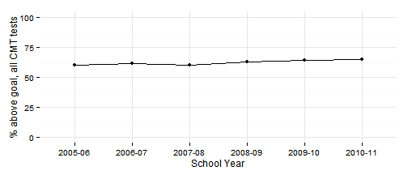 

All subsequent results are for the same period for which test scores are currently available from SDE.

By district, results can vary substantially year-on-year and by test and by school. Districts like Avon and Granby have had the highest performance over time, with Hartford and East Hartford faring the worst. 

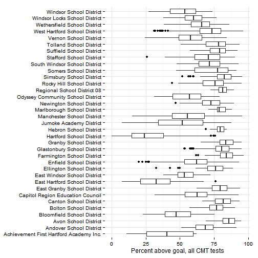 

The results by test show the same patterns. 

### CMT subgroup results

SDE discloses test scores also for the following subgroups: 
* English language learners
* Free / Reduced-price lunch eligibility (as a proxy for household income)
* Gender
* Race / ethnicity
* Special education

Are there differences in test scores for these subgroups? (And are these differences significant?) Results are again for 3rd grade and 8th grade test scores, on math, reading and writing tests, for the past 6 years. 

This view of the achievement gap again shows ELL students performing significantly worse than any other subgroup, followed by Special Education, Hispanic / Latino, Free-lunch eligible and Black students. White, Asian and higher-income (not Free / Reduced Price Lunch Eligible) students perform the best. 

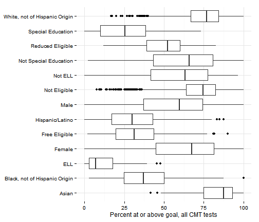 

The gaps between these subgroups have also changed little in the past six years.

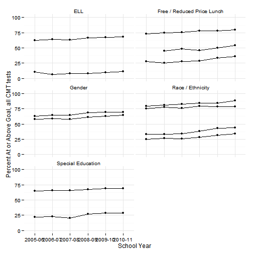 

### CAPT scores

For the CAPT test, there has been a similar slow steady improvement in scores for the region for the past five years. A majority of students are at or above goal, across all tests.

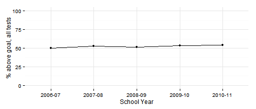 

The percent scoring below basic level has been between 5 - 10 percent of students, generally declining over time. 

All subsequent results are for the same five-year period for which test scores are currently available from SDE.

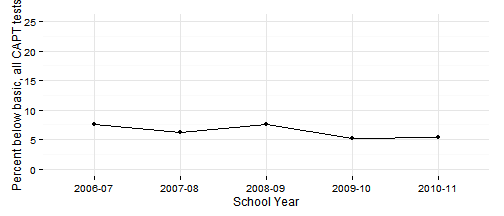 

If we look at school-level results by district, there is more variation within the region. Hartford, Bloomfield and East Hartford have the lowest scores overall, although there are low-scoring schools in other districts, including Enfield and CREC schools. 

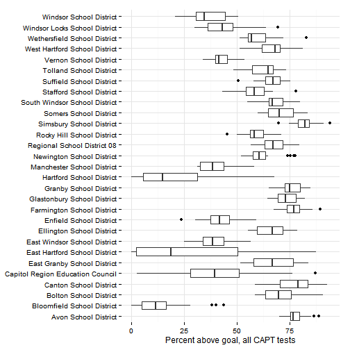 

Looking at the percent scoring below basic level allows for identification of outliers - pockets where individual schools have high percentages of underperforming students. Hartford, East Hartford, Bloomfield, Manchester and the CREC schools jump out. 

 

### CAPT subgroup results

SDE discloses test scores also for the following subgroups: 
* English language learners
* Free / Reduced-price lunch eligibility (as a proxy for household income)
* Gender
* Race / ethnicity
* Special education

English language-learners (ELL) again have the lowest CAPT scores overall, significantly lower than any other subgroup. Those are followed by special education students, Hispanic / Latino and Black students and students eligible for free / reduced-price lunches. Whites and Asians had the highest scores, among these subgroups. 

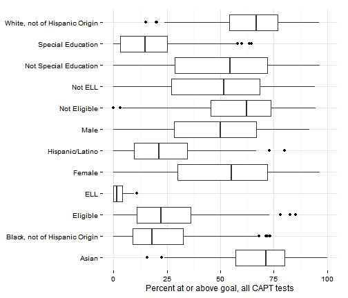 

Trends for the region by subgroup show the same gradual improvements with the gap between subgroups remaining roughly constant for each group. 

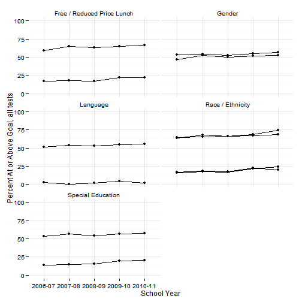 

Similarly, the percent scoring below basic has been gradually declining, with the highest levels for ELL students. 

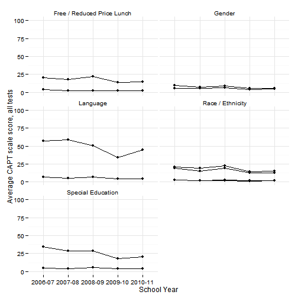 

### Sheff performance scores

[Results for the Sheff case](http://www.ctmirror.org/node/143623) were released in late 2013 by SDE. The test score results show increases of 20 - 40 percent for performance at goal or proficiency for students participating in choice or magnet school programs. 

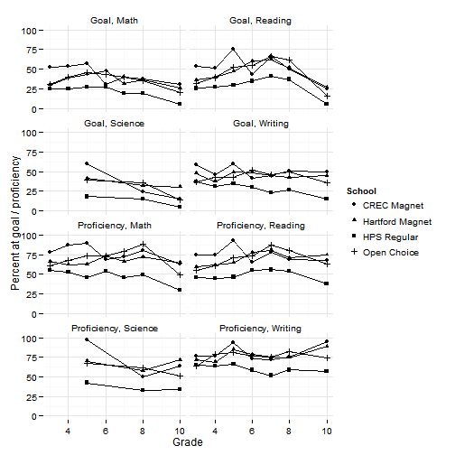 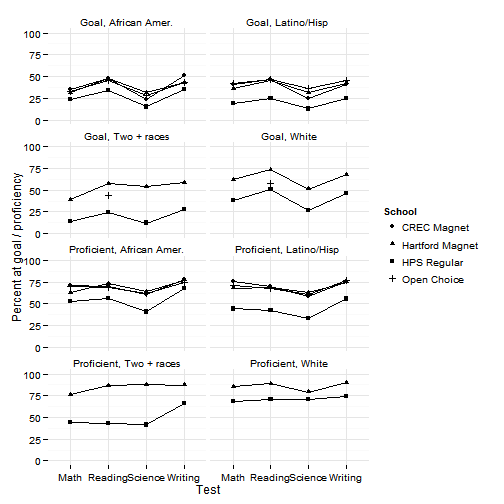 

